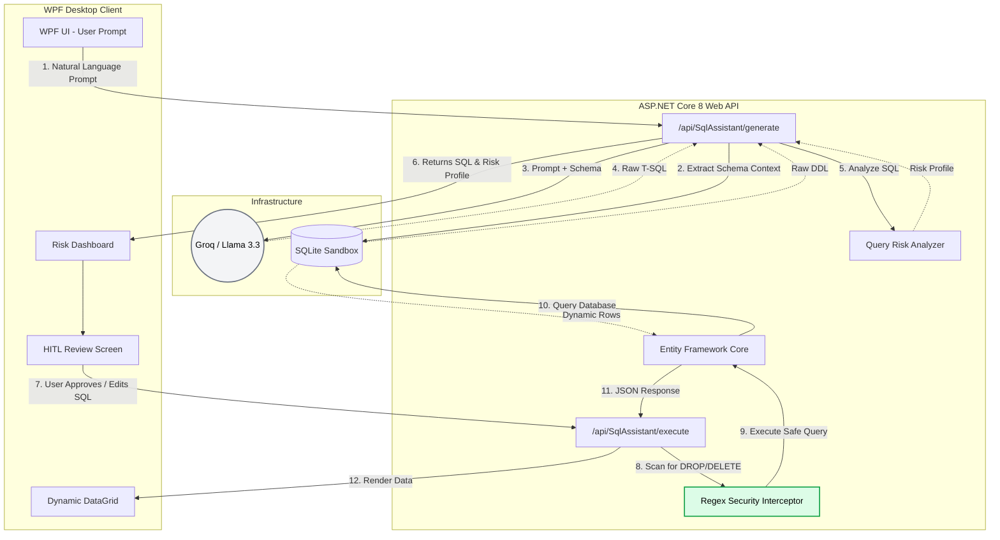

# AI SQL Assistant

An enterprise-grade, decoupled desktop application that translates natural language into executable T-SQL queries using open-source LLMs (Llama 3.3). It features dynamic database schema discovery, a strict Regex security layer, a custom risk-analyzer engine, and a "Human-in-the-Loop" (HITL) execution workflow.

## 🏗️ Enterprise Architecture

This project strictly follows separation of concerns, dividing data orchestration, AI metadata injection, and desktop presentation into decoupled layers.



## 🚀 Core Features

* **Dynamic Schema Discovery (Context Injection):** The backend interrogates internal SQLite metadata (`sqlite_master`) to dynamically extract exact `CREATE TABLE` DDL structures at runtime. This context is seamlessly injected into the LLM system prompt.
* **Query Risk Analyzer:** Before presenting the SQL to the user, the API parses the query, maps out the execution path, identifies affected tables, and calculates a risk score (LOW/MEDIUM/CRITICAL) for visual display.
* **Human-in-the-Loop (HITL) Workflow:** Queries are never executed blindly. The API returns the raw SQL to the client, forcing the user to review, modify, and manually approve the query.
* **Regex Security Interceptor:** If a user (or the AI) attempts to execute destructive DML/DDL commands (e.g., `DROP`, `DELETE`, `UPDATE`), a server-side interceptor immediately kills the connection and returns a security alert.
* **Dynamic Data Rendering:** Utilizes Entity Framework Core with low-level `DbDataReader` mapping to handle dynamic query outputs without hardcoded C# runtime models, streaming JSON rows directly into dynamically generated WPF DataGrid columns.

## 🛠️ Tech Stack

* **Language:** C# 12
* **Framework:** .NET 8.0 / WPF
* **ORM & Database:** Entity Framework Core / SQLite
* **AI Integration:** `Betalgo.OpenAI` SDK (Rerouted to Groq for Llama 3.3 70B inference)

## ⚙️ How to Run Locally

### Prerequisites

* Visual Studio 2022
* .NET 8.0 SDK
* A free API Key from [Groq](https://console.groq.com/)

### Setup

1. Clone this repository.
2. Navigate to `AiSqlAssistant.Api/appsettings.json` and insert your API key:
```json
"OpenAI": {
  "ApiKey": "gsk_YOUR_API_KEY_HERE"
}

```


3. Set both `AiSqlAssistant.Api` and `AiSqlAssistant.Client` as startup projects in Visual Studio.
4. Run the solution (**F5**). The API will automatically provision the SQLite database sandbox and seed sample data on launch.

