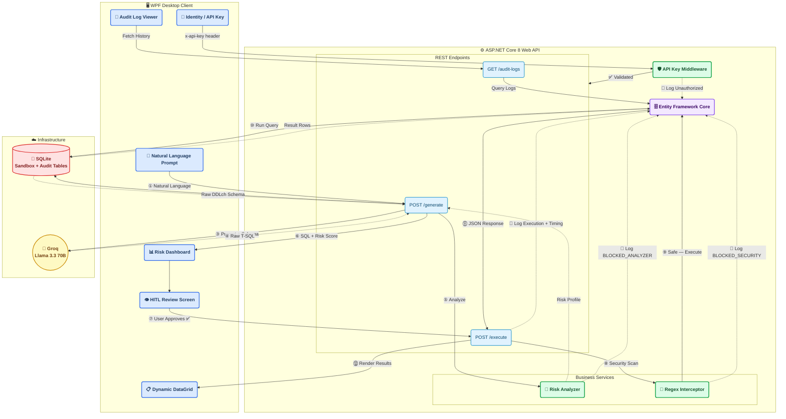
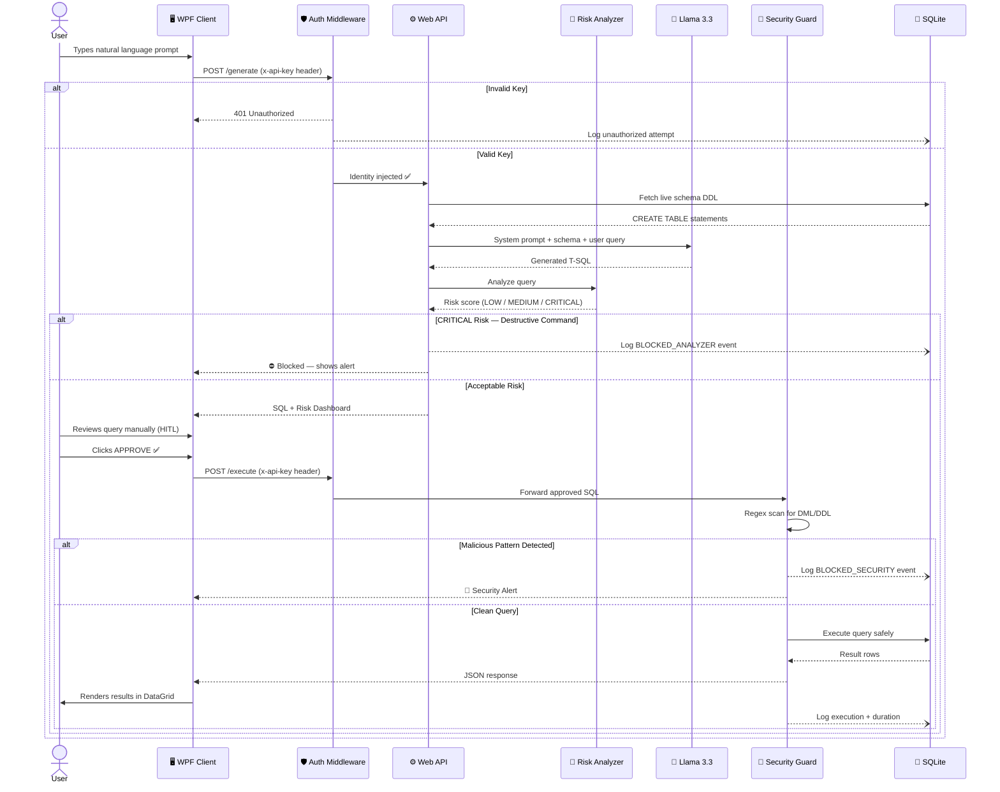
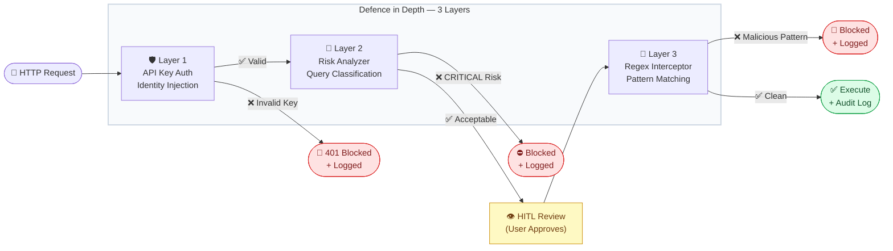

<div align="center">

# 🤖 AI SQL Assistant

### *Speak Human. Query Data.*

An enterprise-grade, decoupled desktop application that translates natural language
into executable T-SQL using open-source LLMs — protected by a multi-layer security shield.

[](https://dotnet.microsoft.com/)
[](https://docs.microsoft.com/en-us/dotnet/desktop/wpf/)
[](https://docs.microsoft.com/en-us/aspnet/core/)
[](https://www.sqlite.org/)
[](https://groq.com/)
[](LICENSE)

<br/>

> **"Never execute a query you didn't understand. Never understand a query without context."**

<br/>

[🚀 Quick Start](#️-how-to-run-locally) · [🏗️ Architecture](#️-enterprise-architecture) · [✨ Features](#-core-features) · [☁️ Cloud Deployment](#-cloud-deployment-azure) · [🛠️ Tech Stack](#️-tech-stack)

</div>

---

## 📖 What Is This?

AI SQL Assistant bridges the gap between **human intent** and **database queries**.
Instead of writing T-SQL by hand, analysts simply describe what they want in plain English —
the system handles schema discovery, query generation, risk analysis, security validation,
and audit logging automatically.

Built for teams that need **AI-powered productivity without sacrificing governance**.

---

## 🏗️ Enterprise Architecture

This project enforces strict **separation of concerns** — splitting data orchestration,
AI metadata injection, and desktop presentation into fully decoupled layers,
protected by an identity-aware middleware shield.



---

## 🔄 Request Lifecycle



---

## ✨ Core Features

### 🔑 Identity & Access Management

A custom **ASP.NET Core Middleware** intercepts every HTTP request before it reaches any controller. It validates `x-api-key` headers, resolves user identity, and injects it into the server context. Unauthorized attempts are immediately blocked **and silently logged** for forensic review.

---

### 🚀 Dynamic Schema Discovery

The backend interrogates SQLite's internal `sqlite_master` catalog at runtime to extract live `CREATE TABLE` DDL. This schema is injected into the LLM system prompt — so the model *always* generates SQL against your actual table structure, eliminating hallucinated column names.

---

### 🔬 Query Risk Analyzer

Before any SQL reaches the user, the API parses the query, maps the execution path, identifies affected tables, and assigns a **risk classification**:

| Score | Label | Meaning |
| --- | --- | --- |
| 🟢 | `LOW` | Safe read operation |
| 🟡 | `MEDIUM` | Complex joins / aggregations |
| 🔴 | `CRITICAL` | Destructive or schema-altering |

### 👁️ Human-in-the-Loop (HITL)

Queries are **never executed blindly**. The API returns the raw SQL alongside its risk profile. The user must manually review, understand, and explicitly approve execution — turning every query into a conscious decision.

---

### 🚧 Regex Security Interceptor

Even after HITL approval, a **server-side regex engine** performs a final scan at the execution endpoint. If destructive `DROP`, `DELETE`, `TRUNCATE`, or DDL commands are detected — whether from AI hallucination or malicious edits — the request is killed instantly and a security event is logged.

---

### 📜 Enterprise Audit Logging

A silent governance pipeline records every interaction with full identity attribution:

* ✅ `EXECUTED` — query, duration, row count, user
* ⛔ `BLOCKED_ANALYZER` — risk-blocked events
* 🚫 `BLOCKED_SECURITY` — interceptor-blocked events
* 🔒 `UNAUTHORIZED` — identity failures

---

## ☁️ Cloud Deployment (Azure)

The production backend is architected to run in a cloud-native ecosystem.

### Serverless Hosting

* **App Layer:** Hosted seamlessly via **Azure App Services** on a scalable infrastructure.
* **Configuration Override:** Real API secrets and user key registries are safely isolated within **Azure Environment Variables**, keeping raw credentials completely out of source control.

### Shifting WPF to Cloud Mode

To switch your native client interface to communicate with your live cloud environment rather than a local sandbox machine, configure the endpoint inside `ApiService.cs`:

```csharp
// Local Development Sandbox
// private readonly string _baseUrl = "https://localhost:7092/api/SqlAssistant";

// Production Azure Cloud
private readonly string _baseUrl = "[https://your-app-service-name.azurewebsites.net/api/SqlAssistant](https://your-app-service-name.azurewebsites.net/api/SqlAssistant)";

```

---

## 🛠️ Tech Stack

```
┌─────────────────────────────────────────────────────────────────┐
│                        AI SQL ASSISTANT                         │
├──────────────────────────┬──────────────────────────────────────┤
│  Presentation Layer      │  WPF (.NET 8) · C# 12                │
├──────────────────────────┼──────────────────────────────────────┤
│  API Layer               │  ASP.NET Core 8 Web API              │
├──────────────────────────┼──────────────────────────────────────┤
│  AI / LLM                │  Llama 3.3 70B via Groq              │
│                          │  Betalgo.OpenAI SDK (rerouted)       │
├──────────────────────────┼──────────────────────────────────────┤
│  Data / ORM              │  Entity Framework Core · SQLite      │
├──────────────────────────┼──────────────────────────────────────┤
│  Language                │  C# 12                               │
│  Target Framework        │  .NET 8.0                            │
└──────────────────────────┴──────────────────────────────────────┘

```

---

## 🔐 Security Architecture



---

## ⚙️ How to Run Locally

### Prerequisites

| Requirement | Version | Link |
| --- | --- | --- |
| Visual Studio | 2022+ | [Download](https://visualstudio.microsoft.com/) |
| .NET SDK | 8.0 | [Download](https://dotnet.microsoft.com/download/dotnet/8.0) |
| Groq API Key | Free tier | [Get Key](https://console.groq.com/) |

### 1️⃣ Clone the Repository

```bash
git clone [https://github.com/your-username/ai-sql-assistant.git](https://github.com/your-username/ai-sql-assistant.git)
cd ai-sql-assistant

```

### 2️⃣ Configure API Keys

Open `AiSqlAssistant.Api/appsettings.json` and insert your credentials:

```json
{
  "OpenAI": {
    "ApiKey": "gsk_YOUR_GROQ_API_KEY_HERE"
  },
  "ApiKeys": {
    "dev-key-777":   "Admin User",
    "guest-key-111": "Guest Analyst"
  }
}

```

> 💡 **Tip:** The `ApiKeys` section is your user registry.
> Each key maps to a named identity visible in audit logs.

### 3️⃣ Configure Startup Projects

In Visual Studio:

```
Right-click Solution → Properties
  → Startup Project → Multiple startup projects
    → AiSqlAssistant.Api    [Start]
    → AiSqlAssistant.Client [Start]

```

### 4️⃣ Launch

Press **`F5`** — the API automatically:

* Provisions the SQLite database
* Runs EF Core migrations
* Seeds sample business data

The WPF client launches and connects automatically. ✅

---

## 🤝 Contributing

Contributions are welcome! Please open an issue first to discuss what you'd like to change.

1. Fork the repository
2. Create your feature branch (`git checkout -b feature/amazing-feature`)
3. Commit your changes (`git commit -m 'Add amazing feature'`)
4. Push to the branch (`git push origin feature/amazing-feature`)
5. Open a Pull Request

---

## 📄 License

Distributed under the MIT License. See [`LICENSE`](https://www.google.com/search?q=LICENSE) for more information.

Built with ❤️ using .NET 8 · WPF · ASP.NET Core · Llama 3.3

⭐ **Star this repo if it was useful to you!** ⭐