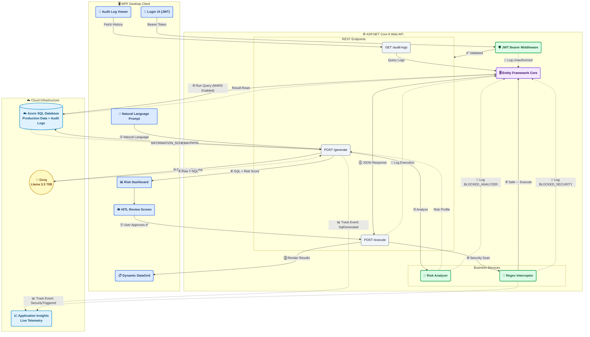
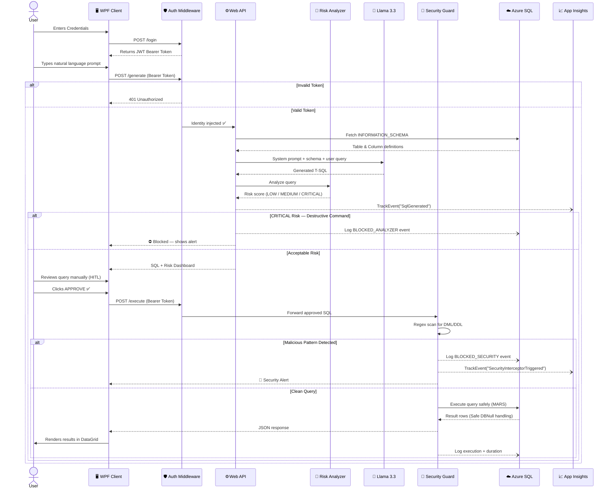

# 🤖 AI SQL Assistant (v2.0 Enterprise Release)

### *Speak Human. Query Data.*

An enterprise-grade, decoupled desktop application that translates natural language into executable T-SQL using open-source LLMs — protected by a multi-layer security shield, JWT authentication, and live cloud telemetry.

> **"Never execute a query you didn't understand. Never understand a query without context."**

[🚀 Quick Start](#-how-to-run-locally) · [🏗️ Architecture](#-enterprise-architecture) · [✨ Features](#-core-features) · [☁️ Cloud Deployment](#-cloud-deployment-azure) · [🛠️ Tech Stack](#-tech-stack)

---

## 📖 What Is This?

AI SQL Assistant bridges the gap between **human intent** and **database queries**.
Instead of writing T-SQL by hand, analysts simply describe what they want in plain English — the system handles dynamic schema discovery, query generation, risk analysis, security validation, and audit logging automatically.

Built for teams that need **AI-powered productivity without sacrificing governance**, v2.0 introduces full cloud-native capabilities, role-based JWT authentication, and real-time Application Insights telemetry.

---

## 🏗️ Enterprise Architecture

This project enforces strict **separation of concerns** — splitting data orchestration, AI metadata injection, and desktop presentation into fully decoupled layers, protected by an identity-aware JWT middleware shield.



---

## 🔄 Request Lifecycle



---

## ✨ Core Features

### 🔑 Identity & Access Management (JWT)

A custom **ASP.NET Core Middleware** issues and validates cryptographically signed JWTs with an 8-hour expiry. It resolves user identity/roles and injects them into the server context. Every action is identity-stamped for forensic review.

### 🚀 Dynamic Schema Discovery (Azure SQL)

The backend dynamically interrogates Azure SQL's `INFORMATION_SCHEMA` catalog at runtime. This schema is injected into the LLM system prompt — ensuring the model *always* generates T-SQL against your actual, real-time table structure.

### 🔬 Query Risk Analyzer

Before any SQL reaches the user, the API parses the query, maps the execution path, identifies affected tables, and assigns a **risk classification**:

| Score | Label | Meaning |
| --- | --- | --- |
| 🟢 | `LOW` | Safe read operation |
| 🟡 | `MEDIUM` | Complex joins / aggregations |
| 🔴 | `CRITICAL` | Destructive or schema-altering |

### 👁️ Human-in-the-Loop (HITL)

Queries are **never executed blindly**. The API returns the raw SQL alongside its risk profile. The user must manually review, understand, and explicitly approve execution — turning every query into a conscious decision.

### 🚧 Regex Security Interceptor

Even after HITL approval, a **server-side regex engine** performs a final scan at the execution endpoint. If destructive `DROP`, `DELETE`, `TRUNCATE`, or DDL commands are detected, the request is killed instantly and a security event is logged.

### 📈 Application Insights Observability

Fully integrated Azure Telemetry providing live traffic metrics, SQL database dependency tracking, and custom business event monitoring (e.g., tracking whenever the Security Interceptor blocks a malicious prompt).

---

## ☁️ Cloud Deployment (Azure)

The production backend is architected to run in a cloud-native Microsoft ecosystem.

* **App Layer:** Hosted seamlessly via **Azure App Services**.
* **Database Layer:** Powered by **Azure SQL Database** with MARS (Multiple Active Result Sets) enabled for high-performance concurrent reads/writes.
* **Configuration Override:** Real API secrets, connection strings, and JWT keys are safely isolated within **Azure Environment Variables**, keeping raw credentials completely out of source control.

### Shifting WPF to Cloud Mode

To switch your native client interface to communicate with your live cloud environment rather than a local sandbox machine, configure the endpoint inside `ApiService.cs`:

```csharp
// Local Development Sandbox
// private readonly string _baseUrl = "https://localhost:7092/api/SqlAssistant";

// Production Azure Cloud
private readonly string _baseUrl = "https://your-app-service-name.azurewebsites.net/api/SqlAssistant";
private readonly string _authUrl = "https://your-app-service-name.azurewebsites.net/api/Auth";

```

---

## 🛠️ Tech Stack

```text
┌─────────────────────────────────────────────────────────────────┐
│                        AI SQL ASSISTANT v2                      │
├──────────────────────────┬──────────────────────────────────────┤
│  Presentation Layer      │  WPF (.NET 8) · C# 12                │
├──────────────────────────┼──────────────────────────────────────┤
│  API Layer               │  ASP.NET Core 8 Web API              │
├──────────────────────────┼──────────────────────────────────────┤
│  AI / LLM                │  Llama 3.3 70B via Groq              │
│                          │  Betalgo.OpenAI SDK (rerouted)       │
├──────────────────────────┼──────────────────────────────────────┤
│  Data / ORM              │  Entity Framework Core               │
│                          │  Azure SQL Database / LocalDB        │
├──────────────────────────┼──────────────────────────────────────┤
│  Observability           │  Azure Application Insights          │
├──────────────────────────┼──────────────────────────────────────┤
│  Security                │  JWT Bearer Authentication           │
└──────────────────────────┴──────────────────────────────────────┘

```

---

## ⚙️ How to Run Locally

### Prerequisites

| Requirement | Version | Link |
| --- | --- | --- |
| Visual Studio | 2022+ | [Download](https://visualstudio.microsoft.com/) |
| .NET SDK | 8.0 | [Download](https://dotnet.microsoft.com/download/dotnet/8.0) |
| Groq API Key | Free tier | [Get Key](https://console.groq.com/) |

### 1️⃣ Clone the Repository

```bash
git clone https://github.com/your-username/ai-sql-assistant.git
cd ai-sql-assistant

```

### 2️⃣ Configure `appsettings.json`

Open `AiSqlAssistant.Api/appsettings.json` and insert your API keys and JWT secrets. The default connection string uses SQL Server LocalDB for safe sandbox testing:

```json
{
  "ConnectionStrings": {
    "DefaultConnection": "Server=(localdb)\\mssqllocaldb;Database=AiSqlAssistantDB;MultipleActiveResultSets=True;Trusted_Connection=True;"
  },
  "OpenAI": {
    "ApiKey": "gsk_YOUR_GROQ_API_KEY_HERE"
  },
  "Jwt": {
    "Key": "YOUR_SUPER_SECRET_JWT_KEY_MINIMUM_32_BYTES_LONG!",
    "Issuer": "AiSqlAssistantServer",
    "Audience": "AiSqlAssistantClient"
  },
  "ApplicationInsights": {
    "ConnectionString": "YOUR_APP_INSIGHTS_CONNECTION_STRING_HERE"
  },
  "Users": {
    "admin": {
      "Password": "Password123!",
      "Role": "Admin",
      "FullName": "System Administrator"
    }
  }
}

```

### 3️⃣ Configure Startup Projects

In Visual Studio:

```text
Right-click Solution → Properties
  → Startup Project → Multiple startup projects
    → AiSqlAssistant.Api    [Start]
    → AiSqlAssistant.Client [Start]

```

### 4️⃣ Launch

Press **`F5`** — the API automatically:

1. Connects to LocalDB (or Azure SQL).
2. Runs EF Core `EnsureCreated()` to build the schema.
3. Seeds sample business data.

The WPF client launches, presents the secure **Login UI**, and connects automatically once you enter your credentials. ✅

---

## 📄 License

Distributed under the MIT License. See `LICENSE` for more information.

Built with ❤️ using .NET 8 · Azure SQL · WPF · ASP.NET Core · Llama 3.3

⭐ **Star this repo if it was useful to you!** ⭐
